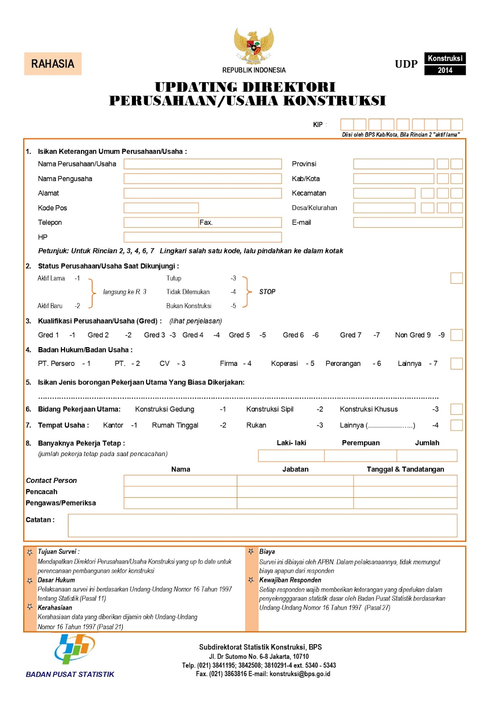

# Pemrograman Berorientasi Objek : Aplikasi Updating Direkotri Perusahaan/Usaha Konstruksi 2014

Sejak tahun 2009, Badan Pusat Statistik (BPS) melakukan kegiatan Updating Direktori Perusahaan/Usaha Konstruksi secara rutin yang dilaksanakan secara sampel di seluruh Indonesia.

Secara garis besar, tujuan dari pengutipan Direktori Perusahaan Konstruksi 2014 adalah membentuk Kerangka Sampel Perusahaan/Usaha Konstruksi yang up-to-date, yang digunakan untuk pengambilan sampel Survei Perusahaan Konstruksi Tahunan (SKTH), Survei Perusahaan Konstruksi Triwulanan (SKTR), dan Survei Usaha Konstruksi Perorangan (SKP).

### Penulis Source Code
#### Kelompok 8 (2KS2)
1. Briel Sevtriobragi Sihaloho	(222212539)
2. Dewi Nurihandayani		(222212564)
3. Fickry Atmayoga Wienaldi 	(222212610)
4. La Ode Muhammad Gazali 	(222212696)

## Deskripsi Singkat
Aplikasi ini digunakan untuk mengumpulkan data perusahaan/usaha konstruksi guna melakukan pembaharuan data direktori usaha konstruksi. Dalam kuisioner ini terdapat jenis pertanyaan terbuka dan tertutup sehingga perlu adanya validasi terhadap inputan yang dimasukkan user ke dalam form, apakah sudah sesuai dengan ketentuan yang ada atau belum. Dalam kuisioner tersebut terdapat 8 rincian pertanyaan dan 2 rincian yang diisi oleh pewawancara/BPS dengan total 27 kolom isian. Berikut tampilan formulir dari Updating Direktori Perusahaan/Usaha Konstruksi 2014.

## Class Diagram
Dalam pembuatan aplikasi validator untuk formulir Updating Direktori Perusahaan/Usaha Konstruksi ini, kami merujuk pada diagram UML berikut sebagai pedoman.

## Aturan validasi
### A. Rincian Keterangan Umum Perusahaan
##### 1. Nama Perusahaan
  - Nama perusahaan hanya berupa huruf kecil maupun besar dan spasi
  - Nama perusahaan tidak boleh kosong

##### 2. Nama Pengusaha
  - Nama pengusaha hanya berupa huruf kecil maupun besar dan spasi
  - Nama pengusaha tidak boleh kosong

##### 3. Alamat perusahaan
  - Alamat perusahaan hanya berupa huruf kecil maupun besar dan spasi
  - Alamat perusahaan tidak boleh kosong

##### 4. Kode Pos
  - Kode pos hanya berupa angka, bukan huruf atau simbol apapun
  - kode pos harus terdiri dari 5 digit angka
  - Kode pos tidak boleh kosong

##### 5. Nomor Telepon
  - Nomor Telepon harus berupa angka, bukan huruf atau simbol apapun
  - Nomor Telepon harus terdiri dari 11-13 angka dan diawali dengan 0
  - Nomor Telepon tidak boleh kosong

##### 6. Nomor Fax
  - Nomor Fax harus berupa angka, bukan huruf atau simbol apapun
  - Nomor Fax harus terdiri dari 8-15 angka
  - Nomor Fax tidak boleh kosong

##### 7. Nomor HP
  - Nomor HP harus berupa angka, bukan huruf atau simbol apapun
  - Nomor HP harus terdiri dari 11-13 angka dan diawali dengan 0
  - Nomor HP tidak boleh kosong

##### 8. Nama Provinsi
  - Nama Provinsi hanya berupa huruf kecil maupun besar dan spasi
  - Nama Provinsi tidak boleh kosong

##### 9. Kode Provinsi
  - Kode Provinsi harus berupa angka, bukan huruf atau simbol apapun
  - Kode Provinsi terdiri atas 2 digit
  - Kode Provinsi diawali angka 1-9
  - Kode Provinsi diakhiri 1-9
  - Kode Provinsi tidak boleh kosong

##### 10. Nama Kab/Kota
  - Nama Kab/Kota hanya berupa huruf kecil maupun besar dan spasi
  - Nama Kab/Kota tidak boleh kosong

##### 11. Kode Kab/Kota
  - Kode Kab/Kota harus berupa angka, bukan huruf atau simbol apapun.
  - Kode Kab/Kota tediri atas 2 digit
  - Kode Kab/Kota harus diawali 0,1,2 atau 7. Dengan keterangan 0,1,2 merupakan kabupaten dan 7 merupakan kota
  - Kode Kab/Kota diakhiri 1-9
  - Kode Kab/Kota tidak boleh kosong

##### 12. Nama Kecamatan
  - Nama Kecamatan hanya berupa huruf kecil maupun besar dan spasi
  - Nama Kecamatan tidak boleh kosong

##### 13. Kode Kecamatan
  - Kode Kecamatan harus berupa angka, bukan huruf atau simbol apapun.
  - Kode Kecamatan harus terdiri dari 3 digit
  - Kode Kecamatan tidak boleh kosong

##### 14. Nama Desa/Kelurahan
  - Nama Desa/Kelurahan hanya berupa huruf kecil maupun besar dan spasi
  - Nama Desa/Kelurahan tidak boleh kosong

##### 15. Kode Desa/Kelurahan
  - Kode Desa/Kelurahan harus berupa angka, bukan huruf atau simbol apapun.
  - Kode Desa/Kelurahan harus terdiri dari 3 digit
  - Kode Desa/Kelurahan tidak boleh kosong

##### 16. Email
  - Format alamat email user@domain.tld
  - user dan domain dapat berupa huruf (a-z), angka (0-9), tanda hubung (-), titik (.), dan garis bawah (_)
  - Tanda @ hanya muncul 1 kali, Tidak boleh ada spasi di awal atau akhir alamat email
  - tld (top level domain) dapat berupa huruf kecil atau besar dengan panjang 2-7 karakter
  - Email tidak boleh kosong

### B. Rincian Status Perusahaan/Usaha Saat Dikunjungi
##### 17. Status Usaha
  - Status usaha harus berupa angka, bukan huruf atau simbol apapun.
  - Status usaha terbatas pada rentang 1-5
  - Setiap angka mewakili jawaban sesuai yang tertera pada daftar jawaban rincian 2
  - Jika inputan berupa angka 1 atau 2 maka lanjut ke rincian berukutnya. Jika inputan berupa angka 3, 4, atau 5 maka pengisian kuisioner dihentikan
  - Status usaha tidak boleh kosong

### C. Kualifikasi Perusahan/Usaha (Gred)
##### 18. Kualifikasi Perusahaan
  - Kualifikasi perusahaan harus berupa angka, bukan huruf atau simbol apapun.
  - Kualifikasi perusahaan terbatas pada rentang 1-9, tidak termasuk 8
  - Setiap angka mewakili jawaban sesuai yang tertera pada daftar jawaban rincian 3
  - Kualifikasi perusahaan tidak boleh kosong

### D. Rincian Badan Hukum/Badan Usaha
##### 19. Badan Usaha
  - Badan usaha harus berupa angka, bukan huruf atau simbol apapun.
  - Badan usaha terbatas pada rentang 1-7
  - Setiap angka mewakili jawaban sesuai yang tertera pada daftar jawaban rincian 4
  - Badan usaha tidak boleh kosong

### E. Rincian Pekerjaan Utama
##### 20. Pekerjaan Utama
  - Pekerjaan utama hanya berupa huruf kecil maupun besar dan spasi
  - Pekerjaan utama tidak boleh kosong

### F. Rincian Bidang Pekerjaan Utama
##### 21. Bidang Pekerjaan Utama
  - Bidang pekerjaan utama harus berupa angka, bukan huruf atau simbol apapun.
  - Bidang pekerjaan utama terbatas pada rentang 1-3
  - Setiap angka mewakili jawaban sesuai yang tertera pada daftar jawaban rincian 6
  - Bidang pekerjaan utama tidak boleh kosong

### G. Rincian Tempat Usaha
##### 22. Tempat Usaha
  - Tempat usaha harus berupa angka, bukan huruf atau simbol apapun.
  - Tempat usaha terbatas pada rentang 1-4
  - Setiap angka mewakili jawaban sesuai yang tertera pada daftar jawaban rincian 7
  - Tempat usaha tidak boleh kosong

### H. Rincian Banyaknya Pekerja Tetap
##### 23. Banyak Pekerja Tetap
  - Banyak pekerja tetap harus berupa angka, bukan huruf atau simbol apapun
  - Banyak pekerja tetap tidak boleh 0
  - Banyak pekerja tetap tidak boleh kosong

### I. Rincian Contact Person, Pencacah, Pengawas/Pemeriksa
##### 24. Nama
  - Nama hanya berupa huruf kecil maupun besar dan spasi
  - Nama tidak boleh kosong

##### 25. Jabatan
  - Jabatan hanya berupa huruf kecil maupun besar dan spasi
  - Jabatan tidak boleh kosong

##### 26. Tanggal
  - Tanggal berupa angka dan simbo (-) dan harus dalam format dd-mm-yyyy
  - Tanggal tidak boleh kosong

### J. Rincian Kode KIP
##### 27. Kode Identifikasi Perusahaan (KIP)
  - Kode KIP harus berupa angka, bukan huruf atau simbol apapun.
  - Kode KIP harus terdiri dari 9 digit
  - Kode KIP tidak boleh kosong